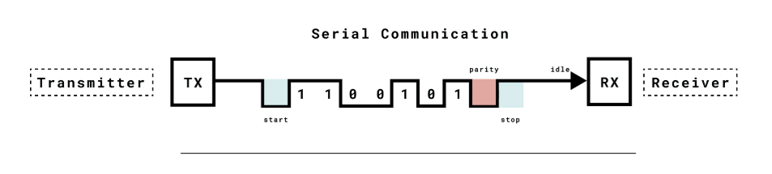

# Hello Tiny :3


I have created this project solely for educational purposes.

Hi, I am Jonathan, and I am a newbie passionate about the world of embedded programming.
In this repo, I would love to share my progress while coding in C on my lovely ATtiny85. ❤️

This approach seems to be the best way for me to learn, memorize, and document my steps in embedded programming.
I have decided to make this repo public because I would love to receive suggestions and protips on how to improve my code.
After a while, it could also become a great starting point for other young embedded programming enthusiasts.

---

## Progress

### I2C
### UART
Implementation of uart communication:
- [ ] Receive
- [x] Transmission



### SSD1306
Implementation of basic functions for display SSD1306:
- [x] Init SSD1306
- [x] Set cursor
- [x] Draw char
- [x] Write text
- [x] Draw bitmap
- [x] Draw pixels*
- [x] Clear

\* there is kind of problem:
 - attiny85 is pretty... ekhm tiny, so there is no space for continuous copy of display in RAM. While setting one segment at once I can put there only one byte so it is impossible to set: `0x01` and next `0x10` with `0x11` as the result.
 - Here I can only set pixels at ONCE without multiple steps per segment

all of commands are described in [documentation](./docs/SSD1306.pdf)  


## My notes

```bash
# basic installation
sudo apt install make gcc-avr avr-libc avrdude

make -v
>>> GNU Make 4.3
>>> Built for x86_64-pc-linux-gnu

avr-gcc --version
>>> avr-gcc (GCC) 7.3.0
```

```bash
# compilation  .c  -> .elf
avr-gcc -mmcu=attiny85 -Os -o main.elf main.c
# where .elf is 'executable and linkable format'
```

```bash
# `-O ihex` determinate output format, ihex stands for intel hex
# `-R .eeprom` ignore eeprom section
avr-objcopy -O ihex -R .eeprom main.elf main.hex
```

```bash
# upload to attiny85
# in this case I am using wsl... but wsl has problems with serial ports
# so I have used avrdude.exe - windows version of avrdude [7.2]
# if you want to use pure linux - replace COMx by /dev/ttySx
avrdude -c arduino -p t85 -P COM7 -b 19200 -U flash:w:main.hex:i
```

### Sources 
usb: https://codeandlife.com/2012/01/29/avr-attiny-usb-tutorial-part-3/ \
i2c: https://www.gadgetronicx.com/attiny85-i2c-protocol-tutorial/ \
SSD1306: https://tinusaur.org/2019/02/10/c-library-for-ssd1306-oled-display-and-attiny85/ \
Makefile #1: https://bytes.usc.edu/cs104/wiki/makefile/ \
Makefile #2: https://makefiletutorial.com/ \
Makefile template ❤️: https://github.com/hexagon5un/AVR-Programming/blob/master/setupProject/Makefile
